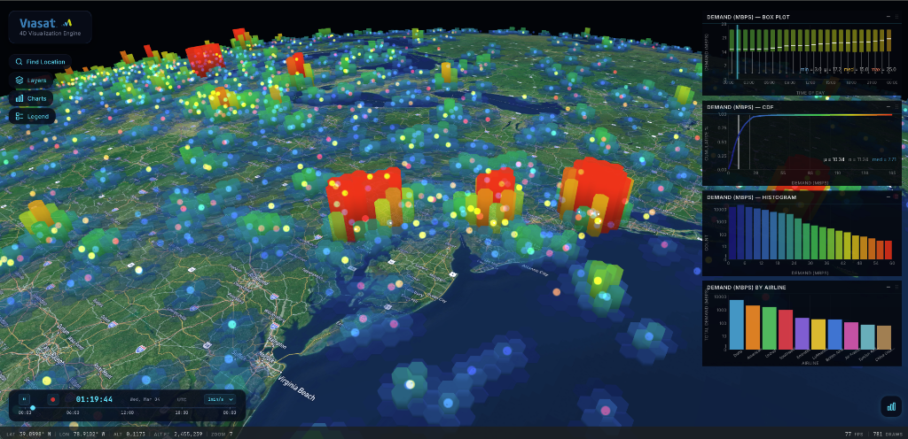

<p align="center">
  
</p>

<h1 align="center">🌍 Globe Trotter</h1>

<p align="center">
  <strong>Open-source. Agentic-first. GPU-accelerated 4D geospatial visualization at massive scale.</strong>
</p>

<p align="center">
  
  
  
  
</p>

**Globe Trotter** is an open-source, agentic-first GPU-accelerated 4D globe engine purpose-built for massive geospatial time series visualization. It is built for anyone with large spatio-temporal datasets — measurements, states, or events that span many locations and many time steps — who needs to understand patterns visually and interactively, without deploying backend tile infrastructure: from telecom and network engineers modeling global coverage and demand, to IoT operators animating millions of device readings, earth observation analysts, aviation and logistics teams tracking movement at planetary scale, and defence teams building temporal situational awareness.

The engine is built around the **Flex format architecture** — three purpose-built GPU zero-copy binary formats that impose no practical ceiling on the number of features, time epochs, or simultaneous metrics in a dataset. The included demo loads **1.47 million H3 hexagons across 1,440 time epochs** (2.1 billion data points), alongside 83,000 animated flight tracks and four GPU-rendered chart panels — all in a single browser tab at 60 FPS. No servers. No tile infrastructure.

> **Read the full story →** [Globe Trotter: 4D Time Series Big Data Visualization at GPU Scale](blog/index.html)

---

## At a Glance

| Scale                         | Performance                      |
| ----------------------------- | -------------------------------- |
| **1.47M** H3 hexagons         | **60 FPS** in the browser        |
| **1,440** time epochs         | **<1ms** epoch transition        |
| **2.1B** data points rendered | **51×** smaller than GeoJSON     |
| **83K** animated tracks       | Static file hosting — no servers |

---

## Agentic-First by Design

"Agentic-first" is not a feature added on top of Globe Trotter — it is the architectural philosophy that shaped every decision. The entire codebase is AI-authored, Subject Matter Expert reviewed and verified. More importantly, Globe Trotter is _designed to be operated by AI agents_: from a raw dataset and a natural-language description of what to visualise, through encoding the data, writing the YAML config, and publishing a live interactive globe — with no human intervention required at any step.

Globe Trotter ships with **10 embedded workspace agent skills** in [`.agents/`](.agents/) that give any AI coding agent expert-level understanding of every subsystem — GPU engine, Flex encoding, styling, charting, deployment, and more. The skills architecture is an open extension point: any team embedding Globe Trotter can add domain-specific skills to give their AI agents expert knowledge of their specific datasets, naming conventions, and deployment targets.

**Key agentic capabilities:**

- **YAML-driven configuration** is ideal for LLM generation — an agent describes what it wants in natural language, the YAML schema is the contract, and the engine handles rendering entirely
- **Static file architecture** means AI agents never need to manage servers or containers — generate Flex files, upload to a bucket, the globe is live
- **End-to-end automation** — ingest from GeoJSON, CSV, Parquet, BigQuery, or PostGIS; encode Flex formats; write YAML config; publish a live globe — all from a single natural language request

---

## Generate, Configure, Share

Globe Trotter collapses the entire workflow — from raw data to a shareable interactive globe — into three steps:

1. **Generate Flex Data** — convert any source (CSV, Parquet, BigQuery, PostGIS) into H3Flex, GeoFlex, or MetricFlex using the Data SDK
2. **Write a YAML Config** — define layers, styles, camera, and time settings in a single `globe-config.yaml`; no JavaScript required
3. **Share a URL** — upload data and config to any static host; your audience sees a live 4D globe with no install and no login

> No web servers to deploy. No Docker containers. No CI/CD pipelines for your map. Globe Trotter runs entirely in the browser — the engine, rendering, and UI are all client-side. Your Flex data lives in a cloud storage bucket. That's the whole stack.

---

## Prerequisites

- **Node.js 20+** — check with `node --version`

---

## 🚀 Quickstart

```bash
git clone https://github.com/flexmon/globe-trotter.git
cd globe-trotter
npm run setup
```

`npm run setup` will:

1. Install dependencies
2. Prompt for a **Mapbox** or **Google Maps** API key to enable satellite basemap tiles (optional — the globe renders without one)
3. Generate sample data
4. Start the dev server

Your browser will open [localhost:5173](http://localhost:5173) with 1.5M animated H3 hexagons, 83K flight tracks, and live GPU charts.

> [!TIP]
> If you already have a basemap key in your `.env`, setup will detect it and skip the prompt automatically.

---

## ⚡ The Secret Sauce: Flex Binary Formats

The defining feature of Globe Trotter's extreme performance is its **zero-copy architecture**, made possible by its bespoke native binary formats (**H3F**, **GFB**, and **MFB**).

Traditional web mappers rely on parsing heavy arrays of JSON, GeoJSON, or GeoParquet objects before uploading them to the GPU. Globe Trotter's Data SDK instead pre-encodes tabular data into `*Flex` columnar format structures. This allows memory-mapped typed arrays to be loaded seamlessly from the network layer directly into WebGPU storage buffers and shaders — eliminating data copying, intermediate state processing, and expensive hot-path queries.

The compression result: the demo dataset (1.47M hexagons × 1,440 epochs × 3 metrics) would be **87 GB as gzipped GeoJSON**. In H3Flex format with sparse encoding and gzip compression it is **1.7 GB** — a **51× reduction** — and it requires zero CPU parsing to use.

- **[H3Flex (H3F)](https://github.com/flexmon/flex-format/blob/main/architecture/h3flex-binary-architecture.md)**: Hexagonal heatmaps — pre-computed H3 meshes with a temporal attribute tensor; epoch transitions in under 1ms via WebGPU compute scatter.
- **[GeoFlex (GFB)](https://github.com/flexmon/flex-format/blob/main/architecture/geoflex-binary-architecture.md)**: Moving tracks, lines, and polygons — epoch-major position arrays with GPU-interpolated sub-epoch animation.
- **[MetricFlex (MFB)](https://github.com/flexmon/flex-format/blob/main/architecture/metricflex-binary-architecture.md)**: Geometry-free metrics for GPU chart analytics — powers histograms, time-series, and bar charts directly from GPU-resident data.

---

## 📦 Data SDK

Globe Trotter includes a comprehensive data preparation SDK (`@globe-trotter/data-sdk`) that integrates with raw data sources such as BigQuery, CSV, and GeoJSON files. Through intuitive bindings, it allows you to configure complex conversion pipelines to encode your raw telemetry data directly into the hyper-optimized `*Flex` format shards.

- [Data SDK Guide](docs/data-sdk-guide.md)
- [Data SDK Architecture](architecture/formats/data-sdk-architecture.md)

---

## 📚 Documentation

The `globe-trotter` repository is the central hub for documentation related to the broader web of applications and components inside the Globe Trotter ecosystem.

**Getting Started**

- [Developer's Guide](docs/developers-guide.md)
- [Antigravity Vibe Coding Guide](docs/developers-guide-antigravity-vibe.md)

**Platform Extensions**

- [PyFlex (Python SDK)](https://github.com/flexmon/pyflex/blob/main/README.md)
- [Flex-Format (Rust Library)](https://github.com/flexmon/flex-format/blob/main/README.md)

**System Architecture**

- [Zero-Copy Library Architecture](architecture/globe-trotter/library-architecture.md)
- [GPU Charts](architecture/globe-trotter/gpu-chart-architecture.md)
- [Cartographic Styling](architecture/globe-trotter/cartographic-style-architecture.md)
- [Geodetic Coords](architecture/globe-trotter/geodetic-coordinate-system.md)

---

<p align="center">
  
</p>
