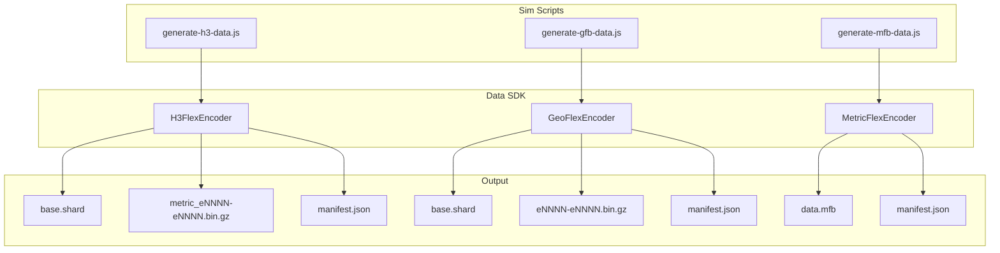

# Data SDK Architecture

## Overview

`@globe-trotter/data-sdk` is the encoding layer for Globe Trotter's three binary formats — H3Flex (`.h3f`), GeoFlex (`.gfb`), and MetricFlex (`.mfb`). It provides high-level encoder classes that handle header packing, schema writing, dictionary encoding, mesh generation, shard creation, gzip compression, and manifest output — replacing hundreds of lines of inline binary manipulation with a clean API.

```
lib/packages/data-sdk/
├── package.json
└── src/
    ├── index.js                      ← Public exports
    └── encoders/
        ├── index.js                  ← Barrel export
        ├── H3FlexEncoder.js          ← H3 hexagonal heatmap encoder
        ├── GeoFlexEncoder.js         ← Vector geometry (point/line/poly) encoder
        └── MetricFlexEncoder.js      ← Geometry-free metric data encoder
```

## Component Diagram



## Encoder Contracts

### H3FlexEncoder

| Method                                    | Purpose                                                                        |
| ----------------------------------------- | ------------------------------------------------------------------------------ |
| **`addColumn(name, data, options?)`**     | **Unified API — auto-infers type, builds dict from string[], routes temporal** |
| `setCells(ids, centers)`                  | Set H3 cell IDs and lat/lon centers                                            |
| `addStaticColumn(name, type, data, dict)` | Low-level: add non-temporal column with explicit type                          |
| `setTemporalData(name, data, epochCount)` | Low-level: set epoch-major temporal metric                                     |
| `setStyle(spec)`                          | Embed style spec in binary                                                     |
| `setDictionary(entries)`                  | Low-level: set string dictionary manually                                      |
| `buildMesh(cellToBoundary, radius)`       | Build GPU-ready 3D mesh with top+side faces                                    |
| `encode(options)`                         | Full pipeline: base + shards + manifest                                        |

### GeoFlexEncoder

| Method                              | Purpose                                                       |
| ----------------------------------- | ------------------------------------------------------------- |
| **`addColumn(name, data)`**         | **Unified API — auto-infers type, builds dict from string[]** |
| `setPositions(positions, bbox)`     | Set epoch-major temporal positions                            |
| `addStaticColumn(name, type, data)` | Low-level: add non-temporal column with explicit type         |
| `setTemporalData(name, data)`       | Set epoch-major temporal attribute column                     |
| `setDictionary(entries)`            | Low-level: set string dictionary manually                     |
| `encode(options)`                   | Full pipeline: base + shards + manifest                       |

### MetricFlexEncoder

| Method                                | Purpose                                                                        |
| ------------------------------------- | ------------------------------------------------------------------------------ |
| **`addColumn(name, data, options?)`** | **Unified API — auto-infers type, builds dict from string[], routes temporal** |
| `setEntityIds(keyName, ids)`          | Set entity ID column                                                           |
| `addStaticColumn(name, type, data)`   | Low-level: add non-temporal column with explicit type                          |
| `addTemporalColumn(name, type, data)` | Low-level: add temporal metric column with explicit type                       |
| `setDictionary(entries)`              | Low-level: set string dictionary manually                                      |
| `encode(options)`                     | Full pipeline: single file + manifest                                          |

## Performance Optimizations

| Optimization                | Description                                                                                    |
| --------------------------- | ---------------------------------------------------------------------------------------------- |
| **Single mesh build**       | H3 mesh built only once after filtering (previously built twice — all cells then active cells) |
| **Gzip level 1**            | Fast compression by default (configurable)                                                     |
| **TypedArray bulk copy**    | `Buffer.from(typedArray.buffer)` for zero-copy writes                                          |
| **Subarray slicing**        | `subarray()` instead of `slice()` — no allocation                                              |
| **SharedArrayBuffer ready** | All data arrays compatible with worker thread sharing                                          |

## Binary Format Reference

The SDK encodes data according to the format specifications documented in:

- [H3Flex Format Skill](../../.agents/skills/h3flex-format/SKILL.md)
- [GeoFlex Format Skill](../../.agents/skills/geoflex-format/SKILL.md)
- [MetricFlex Format Skill](../../.agents/skills/metricflex-format/SKILL.md)
