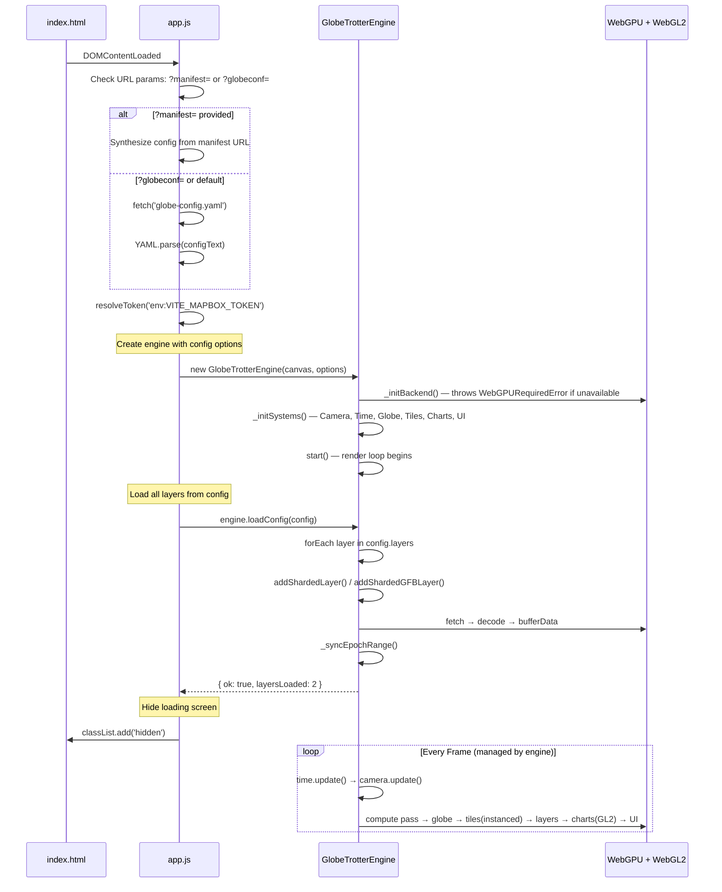

# Globe Trotter App — High-Level Architecture

> **Updated 2026-06: engine is WebGPU-only (WebGL2 removed).**

> A thin Vite-powered SPA that boots `@globe-trotter/core` via a YAML configuration file to visualize geo-temporal data.

## Table of Contents

1. [Overview](#1-overview)
2. [Technology Stack](#2-technology-stack)
3. [Project Structure](#3-project-structure)
4. [Application Bootstrap Sequence](#4-application-bootstrap-sequence)
5. [App vs Library Boundary](#5-app-vs-library-boundary)
6. [Configuration](#6-configuration)
7. [File Inventory](#7-file-inventory)

---

## 1. Overview

The Globe Trotter App is a **thin YAML-driven boot loader** (~70 lines of JavaScript) built on top of `@globe-trotter/core`. The app's only responsibilities are:

1. **Fetch and parse** `globe-config.yaml`
2. **Resolve environment variables** (e.g., Mapbox token)
3. **Create the engine** with config-derived options
4. **Call `engine.loadConfig()`** to load all layers
5. **Hide the loading screen** when init completes

All rendering, data decoding, temporal interpolation, camera control, and interactive UI widgets are handled entirely by the library.

---

## 2. Technology Stack

| Layer         | Technology            | Purpose                                       |
| ------------- | --------------------- | --------------------------------------------- |
| **Build**     | Vite 5                | Dev server (HMR), production bundler          |
| **Rendering** | `@globe-trotter/core` | WebGPU-only engine (locally aliased via Vite) |
| **Data Gen**  | Node.js + `h3-js`     | Offline SHD3 binary data generation           |
| **Testing**   | Jest 29 + Babel       | Unit tests for math, geo, time, flight data   |
| **Env**       | `.env`                | `VITE_MAPBOX_TOKEN` for satellite tiles       |

---

## 3. Project Structure

```
globe-trotter/
├── index.html                 ← Entry point: canvas + loading screen + branding
├── vite.config.js             ← Vite config: @globe-trotter/core alias, GLSL assets
├── package.json               ← App + workspace dependencies
├── .env                       ← VITE_MAPBOX_TOKEN
│
├── src/                       ← App-level code
│   ├── app.js                 ← YAML-driven boot loader (~70 lines)
│   ├── styles.css             ← App CSS (canvas, loading screen, responsive)
│   └── ui/                    ← App-specific UI overrides
│
├── public/                    ← Static assets served by Vite
│   ├── globe-config.yaml      ← YAML configuration (basemap, camera, time, layers, UI)
│   └── data/                  ← Generated binary data (gitignored)
│
├── lib/                       ← Library (workspace symlink)
│   └── packages/core/src/     ← @globe-trotter/core
│
├── scripts/                   ← Offline data generation (Node.js)
├── architecture/              ← Architecture documentation
└── tests/                     ← Jest unit tests
```

---

## 4. Application Bootstrap Sequence

The app follows a progressive loading pattern with a visual loading screen:



### Loading Screen

The engine reports progress via `onProgress(message, percent)` callback. The HTML includes a full-screen loading overlay with animated CSS spinner, progressive status messages, and a fade-out transition once `loadConfig()` resolves.

---

## 5. App vs Library Boundary

```
┌──────────────────────────────────────────────────────────────────┐
│  APP LAYER (src/app.js — ~70 lines)                              │
│                                                                  │
│  • Fetch and parse globe-config.yaml                             │
│  • Resolve env: token references                                 │
│  • Create GlobeTrotterEngine with config options                 │
│  • Call engine.loadConfig(config)                                │
│  • Hide loading screen on completion                             │
│  • Expose engine as window.globe for developer access            │
│                                                                  │
├──────────────── imports from ────────────────────────────────────┤
│                                                                  │
│  LIBRARY LAYER (@globe-trotter/core — GlobeTrotterEngine)        │
│                                                                  │
│  • WebGPU device init (throws WebGPURequiredError if unavailable)│
│  • WebGPU-only render loop (no fallback)                         │
│  • Compute shaders (H3 epoch scatter, histogram reduce)          │
│  • Instanced tile rendering (single draw call via texture array) │
│  • YAML config loading (loadConfig)                              │
│  • Binary format decoding (SHD3: H3F, GFB, DGF, MFB)             │
│  • Style resolution cascade (YAML > sidecar > embedded > default)│
│  • GPU chart system (WebGPU second pass)                         │
│  • Legend panel (draggable, scrollable, adaptive width)          │
│  • Camera controller (navigation, inertia, flyTo)                │
│  • Time controller (playback, speed, epoch adaptation)           │
│  • UI widgets (footer with WebGPU indicator, layers, geocoder)   │
│  • Programmatic API (addLayer, removeLayer, setView, etc.)       │
│                                                                  │
└──────────────────────────────────────────────────────────────────┘
```

> [!NOTE]
> **The app now uses `GlobeTrotterEngine` exclusively.** All WebGPU init, render loop, camera, time, tile management, and layer loading are handled by the engine. The footer displays `WebGPU`. On browsers without WebGPU, the engine throws `WebGPURequiredError` and emits an `'unsupported'` event.

## 6. Configuration

The app is configured via `public/globe-config.yaml`. See the `globe-trotter-yaml-config` skill for the full YAML spec reference.

### URL Parameters

| Parameter              | Effect                                                |
| ---------------------- | ----------------------------------------------------- |
| `?globeconf=path.yaml` | Load from a custom YAML config file                   |
| `?manifest=path.json`  | Load a single H3F sharded layer directly (skips YAML) |

### Build Configuration (`vite.config.js`)

```javascript
resolve: {
    alias: {
        '@globe-trotter/core': resolve(__dirname, 'lib/packages/core/src/index.js'),
    },
},
assetsInclude: ['**/*.vert', '**/*.frag']
```

> [!TIP]
> The alias points directly to source for Vite HMR — editing library files triggers instant reload.

### Environment Variables

| Variable            | Purpose                      | Required                       |
| ------------------- | ---------------------------- | ------------------------------ |
| `VITE_MAPBOX_TOKEN` | Mapbox satellite tile access | No (falls back to Blue Marble) |

---

## 7. File Inventory

| File                       | Lines | Purpose                                |
| -------------------------- | ----- | -------------------------------------- |
| `index.html`               | 43    | Canvas, loading screen, branding       |
| `src/app.js`               | ~70   | YAML-driven boot loader                |
| `src/styles.css`           | 173   | Canvas, loading screen, responsive CSS |
| `public/globe-config.yaml` | 68    | Application configuration              |
| `vite.config.js`           | 15    | Vite: alias to core library            |
| `.env`                     | 1     | `VITE_MAPBOX_TOKEN`                    |

```

```
