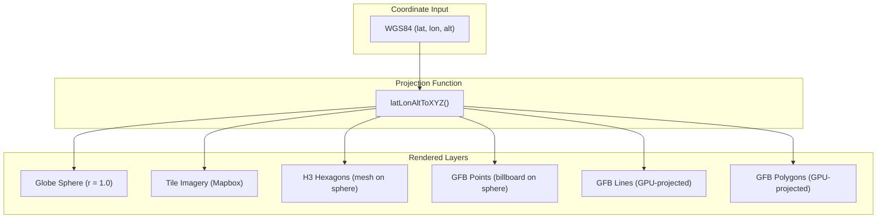

# Geodetic Coordinate System Architecture

> Globe Trotter's spatial reference model: how WGS84 coordinates map to the GPU unit sphere.

## Table of Contents

1. [Overview](#1-overview)
2. [The Core Projection](#2-the-core-projection)
3. [Spherical Approximation vs WGS84 Ellipsoid](#3-spherical-approximation-vs-wgs84-ellipsoid)
4. [Altitude Model](#4-altitude-model)
5. [Axis Convention](#5-axis-convention)
6. [Layer Co-Registration](#6-layer-co-registration)
7. [Z-Fighting Prevention](#7-z-fighting-prevention)
8. [Accuracy Analysis](#8-accuracy-analysis)
9. [Upgrade Path to True WGS84](#9-upgrade-path-to-true-wgs84)
10. [Implementation Reference](#10-implementation-reference)

---

## 1. Overview

Globe Trotter renders all geospatial data on a **unit sphere** (radius = 1.0) centered at the origin. WGS84 geodetic coordinates (latitude, longitude, altitude) are converted to 3D Cartesian coordinates using a **spherical Earth model** — the WGS84 ellipsoidal flattening (~0.3%) is intentionally ignored for GPU efficiency.

This document describes the projection math, axis conventions, altitude scaling, layer co-registration strategy, and the accuracy trade-offs of the spherical approximation.

---

## 2. The Core Projection

Every vertex shader in Globe Trotter converts WGS84 coordinates via the same function:

### GLSL (GPU — vertex shaders)

```glsl
const float PI = 3.14159265359;
const float DEG2RAD = PI / 180.0;
const float GLOBE_RADIUS = 1.0;
const float FEET_TO_GLOBE = 1.0 / 20925525.0;

vec3 latLonAltToXYZ(float lat, float lon, float altFeet) {
    float theta = (90.0 - lat) * DEG2RAD;       // co-latitude (north pole = 0)
    float phi   = (lon + 180.0) * DEG2RAD;       // longitude shifted: -180° → 0
    float r     = GLOBE_RADIUS + altFeet * FEET_TO_GLOBE;
    float st    = sin(theta);
    return vec3(st * sin(phi), cos(theta), st * cos(phi)) * r;
}
```

All geodetic→3D projection is performed exclusively on the GPU. No JavaScript code performs coordinate projection at runtime.

### Mathematical Formulation

Given geodetic coordinates $(λ, φ, h)$ where $λ$ = longitude, $φ$ = latitude, $h$ = altitude in feet:

$$
θ = (90° - φ) × \frac{π}{180}  \quad\text{(co-latitude)}
$$

$$
ψ = (λ + 180°) × \frac{π}{180}  \quad\text{(shifted longitude)}
$$

$$
r = 1.0 + h × \frac{1}{20{,}925{,}525}  \quad\text{(radius)}
$$

$$
(x, y, z) = r × (\sin θ \sin ψ,\; \cos θ,\; \sin θ \cos ψ)
$$

---

## 3. Spherical Approximation vs WGS84 Ellipsoid

### What WGS84 defines

The WGS84 datum defines Earth as an oblate ellipsoid:

| Parameter                           | Value                   |
| ----------------------------------- | ----------------------- |
| Semi-major axis (equatorial radius) | a = 6,378,137.0 m       |
| Semi-minor axis (polar radius)      | b = 6,356,752.3 m       |
| Flattening                          | f = 1/298.257 ≈ 0.00335 |
| Eccentricity²                       | e² = 0.00669            |

### What Globe Trotter uses

A perfect sphere with radius = 1.0 (dimensionless):

| Parameter                 | Value                       |
| ------------------------- | --------------------------- |
| Radius                    | 1.0 (unit sphere)           |
| Flattening                | 0 (none)                    |
| Earth radius for altitude | 20,925,525 ft (mean radius) |

### Why this is acceptable

The maximum difference between geodetic latitude (angle to ellipsoid normal) and geocentric latitude (angle to center) occurs at 45° and equals:

$$
Δφ_{max} = φ_{geodetic} - φ_{geocentric} ≈ 0.19° ≈ 21 \text{ km}
$$

On the unit sphere, 21 km maps to:

$$
21 \text{ km} / 6{,}371 \text{ km} ≈ 0.0033 \text{ globe units}
$$

### Position Error by Latitude

The error follows a sine curve: $Δd ≈ \frac{e^2}{2} × \sin(2φ) × R$, peaking at 45° and zero at the equator and poles.

| Latitude | Δφ (degrees) | Surface Error (km) | Globe Units | Pixels (1000px viewport) |
| -------: | :----------: | :----------------: | :---------: | :----------------------: |
|       0° |    0.000°    |        0.0         |   0.00000   |           0.0            |
|       5° |    0.033°    |        3.7         |   0.00058   |           0.6            |
|      10° |    0.066°    |        7.3         |   0.00115   |           1.1            |
|      15° |    0.096°    |        10.7        |   0.00168   |           1.7            |
|      20° |    0.124°    |        13.7        |   0.00215   |           2.2            |
|      25° |    0.147°    |        16.3        |   0.00256   |           2.6            |
|      30° |    0.166°    |        18.5        |   0.00290   |           2.9            |
|      35° |    0.181°    |        20.0        |   0.00314   |           3.1            |
|      40° |    0.189°    |        21.0        |   0.00330   |           3.3            |
|  **45°** |  **0.192°**  |      **21.3**      | **0.00335** |         **3.3**          |
|      50° |    0.189°    |        21.0        |   0.00330   |           3.3            |
|      55° |    0.181°    |        20.0        |   0.00314   |           3.1            |
|      60° |    0.166°    |        18.5        |   0.00290   |           2.9            |
|      65° |    0.147°    |        16.3        |   0.00256   |           2.6            |
|      70° |    0.124°    |        13.7        |   0.00215   |           2.2            |
|      75° |    0.096°    |        10.7        |   0.00168   |           1.7            |
|      80° |    0.066°    |        7.3         |   0.00115   |           1.1            |
|      85° |    0.033°    |        3.7         |   0.00058   |           0.6            |
|      90° |    0.000°    |        0.0         |   0.00000   |           0.0            |

> [!NOTE]
> At full-globe zoom, the **maximum error is ~3.3 pixels** — well below perceptual threshold. The error is symmetric around 45° and only becomes visible at sub-kilometer zoom, which is beyond Globe Trotter's design envelope.

---

## 4. Altitude Model

### Constants

| Constant        | Value                                   | Source                                         |
| --------------- | --------------------------------------- | ---------------------------------------------- |
| `GLOBE_RADIUS`  | `1.0` / `1.00005` / `1.00015` (shaders) | Unit sphere with per-layer z-fighting offsets  |
| `FEET_TO_GLOBE` | `1.0 / 20925525.0`                      | Earth's mean radius ≈ 20,925,525 ft (6,371 km) |

### Reference altitudes

|               Real-world altitude | Globe units | Visual scale                    |
| --------------------------------: | ----------: | :------------------------------ |
|                  Sea level (0 ft) |     0.00000 | On sphere surface               |
|   Commercial aircraft (35,000 ft) |     0.00167 | Just above surface              |
|       Cruise altitude (40,000 ft) |     0.00191 | Visible separation from surface |
| ISS orbit (1,360,000 ft / 254 mi) |     0.06500 | Clearly above globe             |

### Altitude storage

All data formats store altitude in **feet** (integer or float). This matches aviation conventions and provides sub-foot precision with Float32.

---

## 5. Axis Convention

```
        Y (+up)
        │
        │    North Pole
        │   ╱
        │  ╱
        │ ╱
        ├───────── Z (+forward)
       ╱│
      ╱ │
     ╱  │
    X   │
        │
        South Pole
```

| Axis   | Direction | Geographic meaning                                     |
| ------ | --------- | ------------------------------------------------------ |
| **+Y** | Up        | North pole (θ = 0)                                     |
| **-Y** | Down      | South pole (θ = π)                                     |
| **+Z** | Forward   | φ = 0 → lon = -180° (date line)                        |
| **-Z** | Backward  | φ = π → lon = 0° (prime meridian, approaching from -Z) |
| **+X** | Right     | φ = π/2 → lon = -90° (western hemisphere)              |
| **-X** | Left      | φ = 3π/2 → lon = 90° (eastern hemisphere)              |

### Longitude mapping

The longitude-to-phi mapping shifts by 180° so that the date line (lon = -180°) sits at the front of the sphere (φ = 0):

```
φ = (longitude + 180°) × π/180

lon = -180°  →  φ = 0      (front, +Z)
lon =  -90°  →  φ = π/2    (right, +X)
lon =    0°  →  φ = π      (back, -Z)
lon =   90°  →  φ = 3π/2   (left, -X)
lon =  180°  →  φ = 2π     (front again)
```

This convention places the natural camera "home" view (looking at +Z) over the Pacific, with the Americas on the right and Asia on the left — matching common globe presentations.

---

## 6. Layer Co-Registration

All rendering layers use the **same `latLonAltToXYZ` function** or its equivalent, guaranteeing spatial co-registration:



| Layer        | Projection location            | Method                                           |
| ------------ | ------------------------------ | ------------------------------------------------ |
| Globe        | N/A                            | Hardcoded UV sphere geometry                     |
| Tiles        | GPU (`tile.vert`)              | Vertex shader `latLonToXYZ`                      |
| H3 Hexagons  | Pre-computed in data generator | `cellToBoundary()` → `latLonAltToXYZ` in Node.js |
| GFB Points   | GPU (`gfbpoint.vert`)          | Vertex shader `latLonAltToXYZ`                   |
| GFB Lines    | GPU (`gfbline.vert`)           | Vertex shader `latLonAltToXYZ`                   |
| GFB Polygons | GPU (`gfbpoly.vert`)           | Vertex shader `latLonAltToXYZ`                   |

Because every layer passes through the same trigonometric projection, **all data is automatically co-registered in 3D space**. All runtime projection happens on the GPU — no JavaScript code performs coordinate conversion.

---

## 7. Z-Fighting Prevention

Multiple layers render at or near the sphere surface. Without offsets, identical depth values cause z-fighting (flickering). Globe Trotter uses a layered radius strategy:

| Layer         | `GLOBE_RADIUS`                       | Why                                            |
| ------------- | ------------------------------------ | ---------------------------------------------- |
| Globe surface | `1.0`                                | Base geometry                                  |
| Tiles         | `1.0` (with `LEQUAL` depth func)     | Overlaid on globe                              |
| H3 hexagons   | Vertex positions from mesh (r ≈ 1.0) | Pre-computed on sphere                         |
| GFB polygons  | `1.00005`                            | Slight offset above globe                      |
| GFB lines     | `1.00015`                            | Vertex shader radius constant (above polygons) |
| GFB points    | `1.0 + altitude`                     | Altitude-driven (no depth test)                |

GFB points use a **geometric horizon test** in the vertex shader instead of depth testing, so aircraft are never occluded by H3 pillars or polygons.

---

## 8. Accuracy Analysis

### Position accuracy by use case

| Use case                        | Required accuracy               | Spherical error | Acceptable?              |
| ------------------------------- | ------------------------------- | --------------- | ------------------------ |
| Global flight tracking          | ~10 km                          | ≤ 21 km at 45°  | ✅                       |
| Satellite coverage (H3 res-4/5) | ~15-100 km cells                | ≤ 21 km         | ✅                       |
| Network supply demand           | Cell-level (H3 res-5 ≈ 253 km²) | ≤ 21 km         | ✅                       |
| City-level zoom                 | ~1 km                           | ≤ 21 km         | ⚠️ Marginal              |
| Street-level mapping            | ~10 m                           | N/A             | ❌ Not designed for this |

### Altitude accuracy

Altitude uses Earth's **mean radius** (6,371 km / 20,925,525 ft) rather than the local radius of curvature. The maximum error between equatorial and polar radii is:

$$
6{,}378{,}137 - 6{,}356{,}752 = 21{,}385 \text{ m} ≈ 70{,}128 \text{ ft}
$$

For an aircraft at 40,000 ft, the relative altitude error from using mean radius is:

$$
\frac{70{,}128}{20{,}925{,}525} ≈ 0.34\%
$$

This produces ≤ 136 ft positional error at cruise altitude — negligible for visualization.

---

## 9. Upgrade Path to True WGS84

If a future use case requires sub-kilometer accuracy (e.g., urban planning, precision agriculture), the spherical model can be replaced with a full geodetic-to-ECEF conversion:

```glsl
// WGS84 ellipsoidal conversion (not currently used)
vec3 geodeticToECEF(float lat, float lon, float altMeters) {
    const float a = 6378137.0;           // semi-major axis
    const float e2 = 0.00669437999014;   // eccentricity squared

    float latRad = lat * DEG2RAD;
    float lonRad = lon * DEG2RAD;
    float sinLat = sin(latRad);
    float cosLat = cos(latRad);
    float N = a / sqrt(1.0 - e2 * sinLat * sinLat);  // radius of curvature

    float x = (N + altMeters) * cosLat * cos(lonRad);
    float y = (N + altMeters) * cosLat * sin(lonRad);
    float z = (N * (1.0 - e2) + altMeters) * sinLat;

    // Normalize to unit scale
    return vec3(x, z, y) / a;  // swap Y/Z to match Globe Trotter conventions
}
```

> [!WARNING]
> Switching to ellipsoidal projection requires updating **all** projection points simultaneously — globe geometry, tile projection, H3 mesh generation, and all shaders. Partial migration would break layer co-registration.

### Cost estimate

| Item                         | Spherical cost | Ellipsoidal cost | Overhead      |
| ---------------------------- | -------------- | ---------------- | ------------- |
| `sin/cos` calls per vertex   | 2              | 4                | +2            |
| `sqrt` calls per vertex      | 0              | 1                | +1            |
| Total ALU instructions       | ~10            | ~25              | +150%         |
| Impact at 10M vertices/frame | Negligible     | Measurable       | ~0.5 ms/frame |

The spherical model is recommended for all current use cases (satellite operations, flight tracking, network planning). The ellipsoidal upgrade is documented here for completeness but is not on the roadmap.

---

## 10. Implementation Reference

### Shader files containing `latLonAltToXYZ` / `latLonToXYZ`

| File                           | `GLOBE_RADIUS`          | Context                        |
| ------------------------------ | ----------------------- | ------------------------------ |
| `layers/shaders/gfbpoint.vert` | `1.0`                   | GFB point billboards           |
| `layers/shaders/gfbline.vert`  | `1.00015`               | GFB SDF wide lines             |
| `layers/shaders/gfbpoly.vert`  | `1.00005`               | GFB polygon surfaces           |
| `tiles/shaders/tile.vert`      | `u_tileRadius` (1.0001) | Satellite tile grid projection |

### JavaScript files containing the projection

| File                  | `GLOBE_RADIUS` | Context                                        |
| --------------------- | -------------- | ---------------------------------------------- |
| `ui/AcetateFooter.js` | N/A            | Reverse conversion: globe units → feet display |

### H3 mesh pre-computation (data generators)

| File                          | Method                                                    |
| ----------------------------- | --------------------------------------------------------- |
| `scripts/generate-h3-data.js` | `cellToBoundary()` → `latLonAltToXYZ` → Float32 positions |
