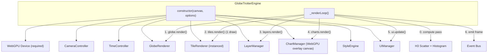
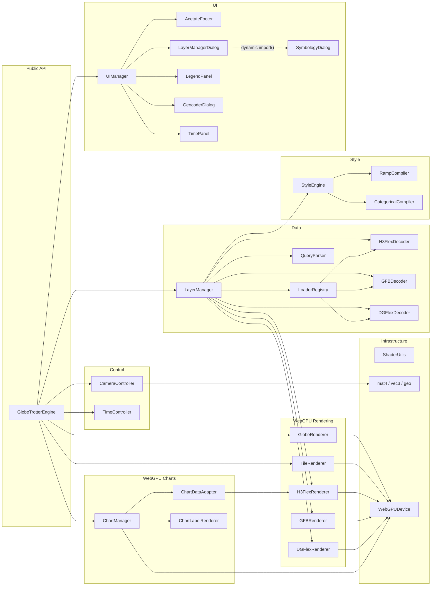

# Globe Trotter Library — High-Level Architecture

> **Updated 2026-06: engine is WebGPU-only (WebGL2 removed).**

> `@globe-trotter/core` — A framework-agnostic, GPU-accelerated 4D globe rendering engine with a **WebGPU-only** backend, Vue and React wrappers.

## Table of Contents

1. [Design Philosophy](#1-design-philosophy)
2. [Package Structure](#2-package-structure)
3. [Core Engine Architecture](#3-core-engine-architecture)
4. [Module Dependency Graph](#4-module-dependency-graph)
5. [Rendering Pipeline](#5-rendering-pipeline)
6. [Data Layer System](#6-data-layer-system)
7. [Style System](#7-style-system)
8. [Time System](#8-time-system)
9. [UI Widget System](#9-ui-widget-system)
10. [Framework Wrappers](#10-framework-wrappers)
11. [Public API Surface](#11-public-api-surface)
12. [File Inventory](#12-file-inventory)

---

## 1. Design Philosophy

The Globe Trotter library is built around five principles:

1. **GPU-native**: Every data structure is designed for direct GPU upload — zero client-side transformation between network and GPU.
2. **WebGPU everywhere**: WebGPU handles both the 3D globe scene (compute shaders, instanced draws, texture arrays) and the 2D charts (rendered on a separate transparent WebGPU overlay canvas that shares the engine's `GPUDevice`). WebGPU is required; no WebGL2 fallback.
3. **Framework-agnostic core**: The engine has zero framework dependencies. A single canvas element and a JavaScript entry point is all that's needed.
4. **Temporal-first**: Time is not an afterthought. The 4th dimension (time) is embedded at every layer — from binary wire formats to shader interpolation to playback controls.
5. **Composable widgets**: UI controls (footer, layer manager, geocoder, time panel) are self-injecting DOM widgets managed by the library. Applications opt in, not out.

---

## 2. Package Structure

The library is a monorepo with three packages:

```
globe-trotter-lib/
├── packages/
│   ├── core/             ← Framework-agnostic engine (ESM)
│   │   └── src/
│   │       ├── index.js                 ← Public API exports
│   │       ├── GlobeTrotterEngine.js    ← Facade: single-class entry point
│   │       ├── camera/                  ← Orbital camera controller
│   │       ├── time/                    ← Simulation clock & playback
│   │       ├── globe/                   ← Base globe renderer (Blue Marble)
│   │       ├── tiles/                   ← Mapbox satellite tile system
│   │       ├── layers/                  ← Data layer decoders & renderers
│   │       ├── styles/                  ← Cartographic style engine
│   │       ├── projection/              ← Spherical / WebMercator projections
│   │       ├── gpu/                     ← WebGPU device initialization
│   │       ├── math/                    ← mat4, vec3, geo (zero-dep)
│   │       └── ui/                      ← Self-injecting UI widgets
│   ├── vue/              ← Vue 3 component wrapper
│   │   └── src/index.js
│   └── react/            ← React 18/19 component wrapper
│       └── src/index.jsx
└── package.json          ← Workspace root
```

> [!IMPORTANT]
> **The core package has zero runtime dependencies.** All math, shader utilities, and format decoders are implemented from scratch. The only dev dependencies are `vite` (build) and `h3-js` (data generation scripts only). All shaders are WGSL (WebGPU).

---

## 3. Core Engine Architecture

The `GlobeTrotterEngine` class is a **facade** that orchestrates all subsystems behind a clean public API:



### Initialization Sequence

1. **WebGPU device** — Requested via `navigator.gpu.requestAdapter()` → `requestDevice()`. Format: `bgra8unorm`. Throws `WebGPURequiredError` if unavailable.
2. **CameraController** — Binds mouse/touch events for orbital navigation with inertia
3. **TimeController** — Starts 24h simulation clock at 60× speed
4. **GlobeRenderer** — Builds UV sphere geometry, loads Blue Marble texture (WGSL pipeline)
5. **TileRenderer** — Instanced tile pipeline with 256-layer texture 2D array
6. **LayerManager** — Ready to accept `addLayer()` calls with WebGPU renderers (H3FlexRenderer, GFBRenderer)
7. **ChartManager** — Initialized with WebGPU command encoder
8. **UIManager** — Injects CSS and creates enabled widget DOM elements; footer shows WebGPU indicator

---

## 4. Module Dependency Graph



---

## 5. Rendering Pipeline

The engine uses a **WebGPU-only** render loop:

### WebGPU Path

```
┌──────────────────────────────────────────────────────────────────┐
│  Frame N — WebGPU (Dual Pass)                                    │
│                                                                  │
│  ┌─ Compute Pass (before render) ──────────────────────────────┐ │
│  │  H3 Epoch Scatter: storage buf → textureStore (R32F)        │ │
│  │  Histogram Reduce: atomicAdd binning (async fire-and-forget)│ │
│  └─────────────────────────────────────────────────────────────┘ │
│                                                                  │
│  ┌─ WebGPU Render Pass ───────────────────────────────────────┐  │
│  │ 1. Globe          UV sphere + Blue Marble (WGSL)           │  │
│  │ 2. Tiles          Single drawIndexedInstanced() (tex array)│  │
│  │ 3. H3 Layers      Hexagon meshes + compute-scattered data  │  │
│  │ 4. GFB Layers     Points/Lines/Polygons (WGSL)             │  │
│  └────────────────────────────────────────────────────────────┘  │
│                    device.queue.submit()                         │
│                                                                  │
│  ┌─ WebGPU Chart Pass (depth=OFF, blend=ON) ──────────────────┐  │
│  │ 5. Charts         Histogram, Heatmap, CDF, BoxPlot, BarPlot│  │
│  │                   GPU text labels (glyph atlas, DPR-aware) │  │
│  └────────────────────────────────────────────────────────────┘  │
│                                                                  │
│  ┌─ UI (DOM) ─────────────────────────────────────────────────┐  │
│  │ 6. Footer (backend indicator), Layer Manager, Time Panel   │  │
│  └────────────────────────────────────────────────────────────┘  │
└──────────────────────────────────────────────────────────────────┘
```

### WebGPU Compute Pipelines

| Pipeline             | Shader                  | Purpose                                | Frequency                |
| -------------------- | ----------------------- | -------------------------------------- | ------------------------ |
| **H3 Epoch Scatter** | `h3_scatter.wgsl`       | Fill R32F textures from storage buffer | Per epoch change         |
| **Histogram Reduce** | `histogram_reduce.wgsl` | Bin 1.4M cells via `atomicAdd`         | Per epoch minute (async) |

### Instanced Tile Rendering (WebGPU)

Instead of 50–150 per-tile draw calls:

- **Texture 2D array**: 256 layers × 512×512 `rgba8unorm`
- **Storage buffer**: per-tile lat/lon bounds + array layer index
- **Single `drawIndexedInstanced()`**: vertex shader reads `instance_index`
- **LRU free list**: recycled layers with 5-second grace period

### Performance: WebGPU

| Metric                  | WebGPU                    |
| ----------------------- | ------------------------- |
| Tile draw calls/frame   | **1** (instanced)         |
| H3 epoch transition     | **<1ms** (compute shader) |
| Histogram (1.4M cells)  | **<0.1ms** GPU (async)    |
| Per-frame GC pressure   | **0 bytes**               |
| Frame Rate (1.4M cells) | **Solid 60 FPS**          |

> [!TIP]
> **Zero-copy design guarantees 60 FPS**. Eliminating layout thrashing and intermediate object instantiation via `SHD3` arrays ensures that the Javascript Engine doesn't have to pause for garbage collection while animating dense temporal transitions.

### Pass 1 — Base Globe

`GlobeRenderer` draws a subdivided UV sphere with Blue Marble albedo texture. Sun direction follows the camera. WGSL shader with bind group layout for uniforms + texture + sampler.

### Pass 2 — Satellite Tiles

`TileManager` computes visible tiles from camera distance. `TileRenderer` uploads tile images into a shared texture 2D array and renders all visible tiles in a **single instanced draw call**. Supports 7 Mapbox basemap styles.

### Pass 3 — Data Layers

`LayerManager` orchestrates all loaded H3Flex and GeoFlex layers using a **two-phase compute+render loop**:

- **Compute phase** (before render pass): For each H3 layer, the compute shader scatters epoch data from a GPU storage buffer into R32F data textures. Epoch transitions are **instant** (<1ms) with zero CPU involvement.
- **Render phase**: Each layer renders using pre-scattered data textures. `H3FlexRenderer` uses WGSL shaders with GPU filter support. `GFBRenderer` handles points, lines, and polygons with temporal interpolation via dual RGBA32F data textures.

### Pass 4 — Charts (WebGPU Second Pass)

Charts render in a **second dedicated WebGPU render pass** directly onto the same canvas. See `gpu-chart-architecture.md` for details.

### Pass 5 — UI Overlay

DOM-based widgets overlaid on the canvas. Footer displays the backend indicator (`WebGPU`), FPS, draw calls, and coordinates.

---

## 6. Data Layer System

### Format Support

| Format                  | Decoder         | Loader         | Renderer         | Geometry Types                  | Temporal                              |
| ----------------------- | --------------- | -------------- | ---------------- | ------------------------------- | ------------------------------------- |
| H3Flex Binary (`.h3f`)  | `H3FlexDecoder` | —              | `H3FlexRenderer` | H3 hexagons (pre-computed mesh) | ✅ Epoch-major attributes             |
| H3Flex Sharded          | `H3FlexDecoder` | `H3FlexShards` | `H3FlexRenderer` | H3 hexagons (pre-computed mesh) | ✅ Sharded with zero-stall swap       |
| DGFlex Sharded          | `DGFlexDecoder` | `DGFlexShards` | `DGFlexRenderer` | Discrete-Global hexagons        | ✅ Sharded with zero-stall swap       |
| GeoFlex Binary (`.gfb`) | `GFBDecoder`    | —              | `GFBRenderer`    | Points, Lines, Polygons         | ✅ Epoch-major positions + attributes |
| GeoFlex Sharded         | `GFBDecoder`    | `GFBShards`    | `GFBRenderer`    | Points, Lines, Polygons         | ✅ Sharded temporal with pre-fetch    |
| MetricFlex (`.mfb`)     | `decodeMFB`     | `MFBShards`    | `MFBDataSource`  | Geometry-free metrics           | ✅ Entity-based time-series           |

### Decoding via SHD3 & Arrow IPC

All decoders consume **SHD3** formats via **zero-copy typed array views** mapped directly from the network buffer or FlexDB's Arrow IPC responses. The client establishes a zero-copy handoff by taking the `ArrayBuffer` directly from `fetch()` or streaming readers, passing it into `Float32Array`, `Uint16Array`, and `BigUint64Array` views without object allocation overhead. These views are mapped natively onto GPU storage buffers.

### Loader Registry

All sharded loaders are constructed via `LoaderRegistry.create(type, manifestUrl, opts)`:

- `'h3f'` → `H3FlexShards`
- `'dgf'` → `DGFlexShards`
- `'gfb'` → `GFBShards`
- `'mfb'` → `MFBShards`
- `'gfb-stream'` → `StreamingGFBLoader`

Loaders share a `ShardLoader` base class for common manifest handling and shard caching. Compression is handled by shared `util/compression.js`.

### Layer Lifecycle

```
addLayer(name, type, url)
    │
    ├── fetch(url) → ArrayBuffer
    ├── decode(buffer) → { header, geometry, attributes, ... }
    ├── resolveStyle(options) → StyleSpec | null
    ├── StyleEngine.compile(gl, styleSpec) → CompiledStyle (GPU textures)
    ├── new Renderer(gl, data, compiledStyle)
    └── register in layers Map
```

### Metric Switching (v3)

H3F sharded layers with multiple temporal metrics support on-demand metric switching:

```
setActiveMetric(layerName, metricName)
    │
    ├── loader.switchMetric(metricName)  ← evict old shards, fetch new
    │     ├── Evict all cached shards
    │     ├── Fetch needed shard for current playback position
    │     ├── Web Worker decode → Float32Array
    │     └── Pre-fetch next shard in background
    ├── renderer.setActiveAttribute(metricName) + forceAmortizedReload()
    └── StyleEngine.compile(perMetricStyle)  ← hot-swap color ramp
```

Only the active metric's shards are in memory. Switching to an RLE metric takes ~100ms (55 KB fetch + decode). Switching to a sparse metric takes ~2-5s (5 MB fetch + decode).

### GPU Filter System

The `QueryParser` (`query/QueryParser.js`) provides a GPU-accelerated filter pipeline that discards non-matching cells/features entirely in the fragment shader — zero CPU per-feature iteration.

```
setFilter(layerName, queryString)
    │
    ├── parseQuery(queryString, schema) → FilterSpec
    │     • Tokenizes AND/OR groups
    │     • Resolves ENUM8/16/32 values via dictionary lookup
    │     • Supports: =, >, <, >=, <=, BETWEEN (low..high)
    ├── flattenForGPU(spec) → { predicates[], combinator }
    │     • Flattens to max 2 predicates for shader
    │     • Combinator: 'AND' or 'OR'
    └── renderer.setFilter(gpuFilter)
          • Uploads predicate uniforms (u_filterOp, u_filterVal)
          • Fragment shader discards non-matching fragments
```

**Query syntax**: `served_mbps > 50 AND custom_region = CONUS` or `served_mbps 100..500`.

The `LayerManagerDialog` includes a filter input field with **context-aware autocomplete** that discovers available columns, operators, and enum values from the dataset schema.

---

## 7. Style System

The `StyleEngine` compiles declarative JSON style specs into GPU textures at sub-millisecond cost:

| Style Type      | Compilation                          | GPU Representation                         |
| --------------- | ------------------------------------ | ------------------------------------------ |
| Color Ramp      | `compileRampData()` → 256×1 RGBA     | 1D texture with LINEAR filtering           |
| Categorical     | `compileCategoricalData()` → N×1 LUT | 1D texture with NEAREST filtering          |
| Multi-attribute | Composes ramp + categorical          | Multiple textures bound to different units |

### Style Resolution Cascade (highest → lowest priority)

1. **YAML `style:` block** — `globe-config.yaml` layer definition
2. **Explicit URL** — `addLayer(..., { styleUrl: '/styles/custom.json' })`
3. **Sidecar file** — `data/demand_metrics.style.json` (auto-discovered)
4. **Embedded style** — `HAS_STYLE` flag in binary header
5. **Geometry-type default** — Point: `#00BFE6`, Line: `#4A90D9`, Polygon: `#2E8B57`, H3F: 5-stop ramp

> **Note:** `_resolveStyle()` always returns a valid style spec — no layer is ever rendered without a compiled style.

---

## 8. Time System

The `TimeController` manages simulation time independently from wall-clock time:

- **Duration**: Defaults to 24h, auto-adjusts via `setEpochRange()` when temporal layers load
- **Speed**: 8 presets from 1× to 1800× (30min/sec), cycleable by the TimePanel
- **Normalized output**: `update()` returns `[0, 1]` — all renderers consume this directly
- **Epoch adaptation**: When a layer with `epochCount × epochInterval < 24h` loads, the TimeController narrows its duration to match the data's temporal extent

---

## 9. UI Widget System

All widgets are DOM elements injected programmatically by the library. The application provides only the container (typically `document.body`).

| Widget                 | Class                                   | Purpose                                                                |
| ---------------------- | --------------------------------------- | ---------------------------------------------------------------------- |
| **AcetateFooter**      | Status bar at viewport bottom           | Coordinates, altitude, FPS, draw calls, **backend indicator** (WebGPU) |
| **LayerManagerDialog** | Floating panel (top-left)               | Layer toggles, symbology button, basemap selector, zoom scale          |
| **SymbologyDialog**    | Centered overlay (lazy-loaded)          | Symbol type/scale, per-category color pickers, opacity                 |
| **LegendPanel**        | Draggable, scrollable popup             | Category swatches or color ramp gradient, zoom scale, adaptive width   |
| **GeocoderDialog**     | Floating panel (top-left, below layers) | Location search with `flyTo()`                                         |
| **TimePanel**          | Fixed panel (bottom-center)             | Clock display, scrubber, play/pause, speed                             |
| **ChartManagerDialog** | Floating panel                          | Chart CRUD, type/source/attribute config, zoom scale                   |

### CSS Injection

`styles.js` exports an `injectStyles()` function that creates a single `<style>` element with all widget CSS. All classes use the `gt-` prefix to avoid collisions with application styles. The library uses CSS custom properties (`--gt-glass-bg`, `--gt-accent-cyan`, etc.) that applications can override.

---

## 10. Framework Wrappers

### `@globe-trotter/vue` (Vue 3)

A `defineComponent` that:

- Creates a `<canvas>` element in `setup()`
- Instantiates `GlobeTrotterEngine` on `onMounted`
- Watches `view`, `speed`, `playing`, and `basemap` props for reactive updates
- Forwards `frame`, `ready`, `layer-added` events via `emit()`
- Exposes `getEngine()` for advanced programmatic access

### `@globe-trotter/react` (React 18/19)

A `forwardRef` component that:

- Renders a `<canvas>` element
- Creates `GlobeTrotterEngine` in a `useEffect` (deps: `[mapboxToken]`)
- Uses separate `useEffect` hooks for `view`, `speed`, `playing`, `basemap` prop changes
- Exposes `getEngine()` via `useImperativeHandle`
- Cleans up via `engine.destroy()` on unmount

> [!TIP]
> **Both wrappers are thin.** They are ~100 lines each and delegate all rendering, data loading, and GPU operations to the core engine. Framework-specific concerns (reactivity, lifecycle hooks) are the only logic in the wrappers.

---

## 11. Public API Surface

### Exports from `@globe-trotter/core`

| Category             | Exports                                                                                                     |
| -------------------- | ----------------------------------------------------------------------------------------------------------- |
| **Primary API**      | `GlobeTrotterEngine`, `WebGPURequiredError`                                                                 |
| **Rendering**        | `GlobeRenderer`, `TileRenderer`, `H3FlexRenderer`, `GFBRenderer`, `DGFlexRenderer`                          |
| **Styling**          | `StyleEngine`, `compileRampData`, `uploadRampTexture`, `compileCategoricalData`, `uploadCategoricalTexture` |
| **Layer Management** | `LayerManager`, `LoaderRegistry`                                                                            |
| **Decoders**         | `decodeH3Flex`, `decodeGFB`, `decodeDGFlex`, `decodeMFB`                                                    |
| **Time**             | `TimeController`                                                                                            |
| **Camera**           | `CameraController`, `MercatorCameraController`                                                              |
| **Projection**       | `SphericalProjection`, `WebMercatorProjection`                                                              |
| **Math**             | `mat4`, `vec3`, `geo`                                                                                       |
| **Charts**           | `ChartManager`, `ChartDataAdapter`, `ChartGPU`                                                              |
| **UI Widgets**       | `UIManager`, `AcetateFooter`, `LayerManagerDialog`, `GeocoderDialog`, `TimePanel`                           |

> **Note:** `SymbologyDialog` and `LegendPanel` are **not** public exports — they are internal components. `SymbologyDialog` is lazy-loaded via dynamic `import()` from `LayerManagerDialog`.

### `GlobeTrotterEngine` Methods

| Category      | Method                                                                                | Description                                    |
| ------------- | ------------------------------------------------------------------------------------- | ---------------------------------------------- |
| **Lifecycle** | `start()`, `stop()`, `destroy()`                                                      | Render loop control                            |
| **Data**      | `addLayer()`, `removeLayer()`, `setLayerStyle()`                                      | Layer CRUD                                     |
| **Metrics**   | `setActiveMetric()` (via `LayerManager`)                                              | v3 on-demand metric switching                  |
| **Filtering** | `setFilter()`, `clearFilter()` (via `LayerManager`)                                   | GPU-accelerated query predicates               |
| **Camera**    | `setView()`, `getView()`, `flyTo()`                                                   | Navigation                                     |
| **Time**      | `play()`, `pause()`, `togglePlay()`, `setSpeed()`, `scrubTo()`, `getNormalizedTime()` | Playback                                       |
| **Basemap**   | `setBasemap()`                                                                        | Switch Mapbox styles                           |
| **Events**    | `on()`, `off()`                                                                       | `frame`, `layerAdded`, `layerRemoved`, `click` |

---

## 12. File Inventory

### Core Package — `lib/packages/core/src/`

| Directory         | Files                                                                                                                                                                                                                                    | Purpose                                                                             |
| ----------------- | ---------------------------------------------------------------------------------------------------------------------------------------------------------------------------------------------------------------------------------------- | ----------------------------------------------------------------------------------- |
| `./`              | `index.js`, `GlobeTrotterEngine.js`                                                                                                                                                                                                      | Public exports, engine facade (WebGPU render loop)                                  |
| `camera/`         | `CameraController.js`, `MercatorCameraController.js`                                                                                                                                                                                     | Orbital camera (3D) + pan/zoom camera (Mercator)                                    |
| `time/`           | `TimeController.js`                                                                                                                                                                                                                      | Simulation clock, playback, epoch adaptation                                        |
| `projection/`     | `SphericalProjection.js`, `WebMercatorProjection.js`                                                                                                                                                                                     | Polymorphic projection dispatch                                                     |
| `globe/`          | `GlobeRenderer.js`, `shaders/globe.wgsl`                                                                                                                                                                                                 | Blue Marble sphere (WebGPU)                                                         |
| `tiles/`          | `TileRenderer.js`, `MercatorTileRenderer.js`, `TileManager.js`, `shaders/tile.wgsl`, `shaders/tile_mercator.wgsl`                                                                                                                        | Instanced tile rendering (WebGPU, dual projection)                                  |
| `layers/`         | `LayerManager.js`, `H3FlexRenderer.js`, `DGFlexRenderer.js`, `GFBRenderer.js`, `GFBLineRenderer.js`, `GFBPolygonRenderer.js`, `H3FlexDecoder.js`, `DGFlexDecoder.js`, `GFBDecoder.js`, `MFBDecoder.js`, `loaders/*.js`, `shaders/*.wgsl` | WebGPU renderers, compute shaders (h3_scatter, histogram_reduce), decoders, loaders |
| `layers/loaders/` | `registry.js`, `ShardLoader.js`, `H3FlexShards.js`, `DGFlexShards.js`, `GFBShards.js`, `MFBShards.js`, `StreamingGFBLoader.js`                                                                                                           | Unified loader registry + shard-based loaders                                       |
| `query/`          | `QueryParser.js`                                                                                                                                                                                                                         | Filter expression parser → GPU predicate uniforms                                   |
| `styles/`         | `StyleEngine.js`, `RampCompiler.js`, `CategoricalCompiler.js`                                                                                                                                                                            | Style compilation to GPU textures                                                   |
| `gpu/`            | `WebGPUDevice.js`                                                                                                                                                                                                                        | WebGPU device initialization                                                        |
| `math/`           | `mat4.js`, `vec3.js`, `geo.js`                                                                                                                                                                                                           | Zero-dependency math library                                                        |
| `charts/`         | `ChartManager.js`, `ChartGPU.js`, `ChartDataAdapter.js`, `ChartPanel.js`, `ChartOverlay.js`, `ChartLabelRenderer.js`, `AxisRenderer.js`, `NowIndicator.js`, `*Renderer.js`, `shaders/chart_*.wgsl`                                       | WebGPU chart system                                                                 |
| `ui/`             | `UIManager.js`, `AcetateFooter.js`, `LayerManagerDialog.js`, `ChartManagerDialog.js`, `SymbologyDialog.js`, `LegendPanel.js`, `GeocoderDialog.js`, `TimePanel.js`, `styles.js`                                                           | Self-injecting DOM widgets with zoom scale support                                  |
